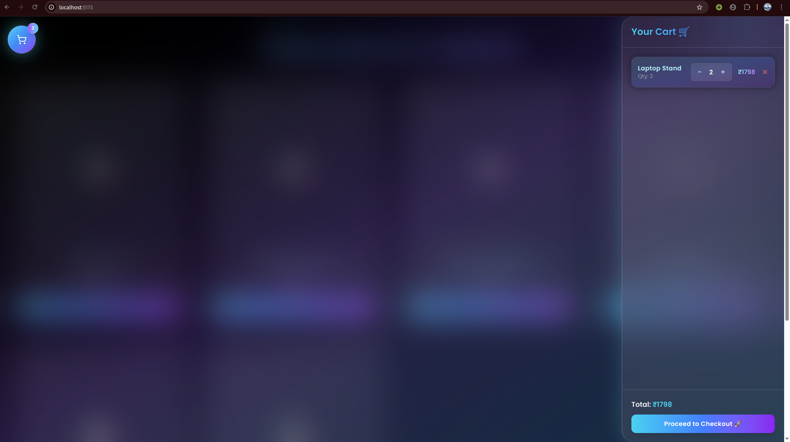
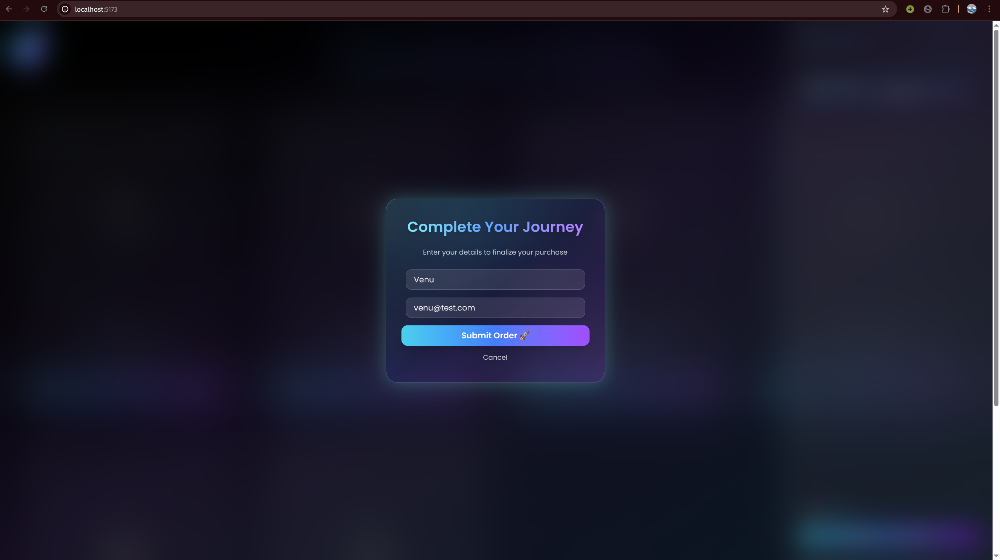
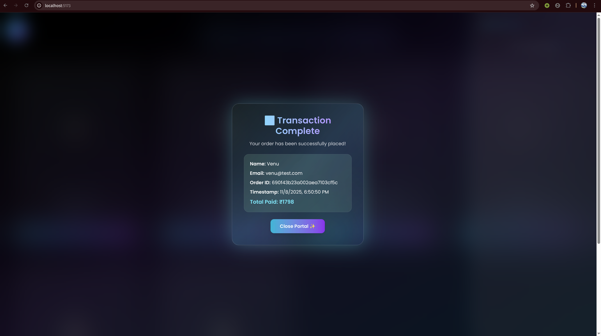

# 🛍️ Vibe Commerce — Mock E-Com Cart

> A futuristic full-stack shopping cart built for the **Vibe Commerce Screening Assignment**.  
> Designed to break traditional e-commerce patterns — featuring glassmorphism, aurora gradients, and fluid animations powered by **React (Vite)**, **TailwindCSS**, **Framer Motion**, and **Express + MongoDB**.

---

## 🚀 Demo & Repo Links

🎥 **Demo Video:** [👉 Watch Here](https://www.loom.com/share/7708b23f24dd42a5a569ba0440c0e270)  
💻 **GitHub Repository:** [https://github.com/suryakrishnakishore/E_Comm_Cart](https://github.com/suryakrishnakishore/E_Comm_Cart)

---

## 🧱 Tech Stack

| Layer | Technology |
|--------|-------------|
| 🎨 Frontend | React (Vite), TailwindCSS, Framer Motion |
| ⚙️ Backend | Node.js, Express.js |
| 🗄️ Database | MongoDB (Local) |
| 🧩 Extras | Axios, Lucide Icons, React Confetti |

---

## ✨ Features

✅ Immersive, futuristic **product grid** with glass-style hover animations  
✅ Smooth **Add to Cart** flow with quantity controls and live total updates  
✅ **Floating Cart Orb** with glowing count badge and particle burst effect  
✅ **Cart Drawer** with animated slide-in and dynamic totals  
✅ **Checkout Modal** with name/email fields  
✅ **Receipt Modal** (shows order ID, timestamp, and total)  
✅ Responsive on all screen sizes  
✅ Fully integrated with local **Express + MongoDB REST APIs**

---

## 🧩 Folder Structure
```bash
.
├── 🧠 backend
│ ├── 📂 controllers
│ │ ├── 🛒 cartController.js
│ │ ├── 📦 ordersController.js
│ │ └── 🏷️ productController.js
│ ├── ⚙️ index.js
│ ├── 📂 libs
│ │ └── 🧩 database.js
│ ├── 📂 models
│ │ ├── 🛍️ cartItem.js
│ │ ├── 🧾 order.js
│ │ └── 📦 product.js
│ ├── 📜 package.json
│ ├── 📜 package-lock.json
│ ├── 📂 routes
│ │ ├── 🛒 cartRoutes.js
│ │ ├── ⚙️ index.js
│ │ ├── 📦 orderRoutes.js
│ │ └── 🏷️ productRoutes.js
│ └── 🌱 seed
│ └── 🧺 seedProducts.js
│
├── 💻 frontend
│ ├── ⚙️ eslint.config.js
│ ├── 🪩 index.html
│ ├── 📜 package.json
│ ├── 📜 package-lock.json
│ ├── 📂 public
│ │ └── 🎨 vite.svg
│ ├── 📄 README.md
│ ├── 📂 src
│ │ ├── 🌐 api
│ │ │ └── 🔗 client.js
│ │ ├── 🧩 App.jsx
│ │ ├── 📦 components
│ │ │ ├── 🛒 cartDrawer.jsx
│ │ │ ├── 🎁 cartItem.jsx
│ │ │ ├── 💳 CheckoutFormModal.jsx
│ │ │ ├── 🧾 CheckoutReceiptModal.jsx
│ │ │ └── 🪄 FloatingCartButton.jsx
│ │ ├── 🧠 context
│ │ │ └── 🛍️ cartContext.jsx
│ │ ├── 🎨 index.css
│ │ ├── 🚀 main.jsx
│ │ └── 📄 pages
│ │ └── 🏬 productsPage.jsx
│ └── ⚙️ vite.config.js
│
└── 📘 README.md
```

---

## ⚙️ Setup Instructions

### 1️⃣ Clone the Repository
```bash
git clone https://github.com/YOUR_USERNAME/vibecommerce-mock-cart.git
cd vibecommerce-mock-cart
```
### 2️⃣ Setup Backend
```bash
cd backend
npm install
npm run seed
npm start
```
Backend runs on 👉 http://localhost:3000

### Ensure that your MongoDB service is running locally.
### 3️⃣ Setup Frontend
```bash
cd frontend
npm install
npm run dev
```
Frontend runs on 👉 http://localhost:5173

## 🔌 API Endpoints
| Method   | Endpoint        | Description                     |
| -------- | --------------- | ------------------------------- |
| `GET`    | `/api/products` | Fetch all products              |
| `POST`   | `/api/cart`     | Add product to cart             |
| `GET`    | `/api/cart`     | Retrieve current cart           |
| `PUT`    | `/api/cart/:id` | Update cart item quantity       |
| `DELETE` | `/api/cart/:id` | Remove product from cart        |
| `POST`   | `/api/checkout` | Mock checkout → returns receipt |

## 📸 Screenshots
| Feature           | Screenshot                                              |
| ----------------- | ------------------------------------------------------- |
| 🛍️ Products Grid |  |
| 🛒 Cart Drawer    |          |
| 💳 Checkout Modal |  |
| 🧾 Receipt Modal  |    |

## 🧠 Notes

- 🧾 Checkout is **mocked** — no real payments involved.  
- ⚙️ Backend built with **Express + Mongoose**.  
- 💾 Uses **local MongoDB** for persistence.  
- 🎨 All animations created using **Framer Motion**.  
- 🌈 Styling crafted with **TailwindCSS** and **Aurora gradients**.

---

## 🪩 UI Highlights

- 💎 **Glassmorphic** product cards with glowing neon accents  
- 🌈 **Animated aurora gradient** background for a futuristic vibe  
- ⚡ **Particle burst effect** when items are added to cart  
- 🧊 **Soft blur and depth shadows** for a layered 3D look  
- 🎆 **Futuristic modal transitions** for checkout and receipts  

## 💻 Development Commands
```bash
# Run Backend
cd backend
npm run dev

# Run Frontend
cd ../frontend
npm run dev
```

## 👨‍💻 Author
**S.S Krishna Kishore**  
📧 [suryakrishnakishore@gmail.com](mailto:suryakrishnakishore@gmail.com)  
💼 [LinkedIn](https://linkedin.com/in/kishore-ssk)  
🐙 [GitHub](https://github.com/suryakrishnakishore)
